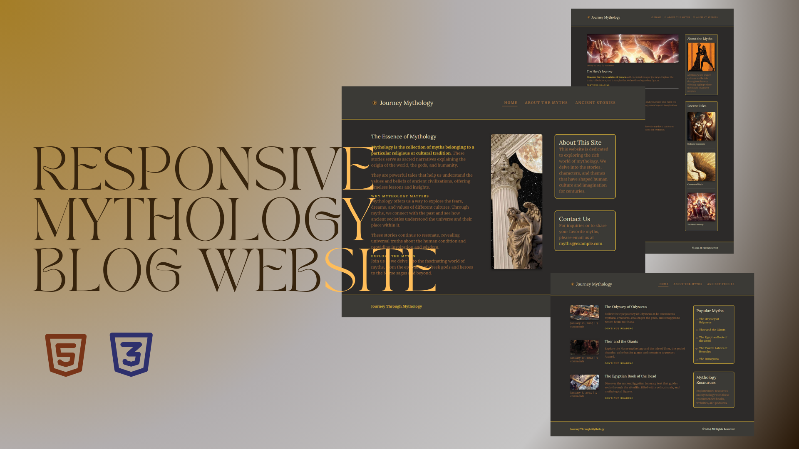

# Mythology Blog

## Description

**Mythology Blog** is a responsive test site designed to explore and showcase my web development skills, specifically focusing on creating a fully responsive layout using only HTML and CSS. This site serves as a personal project to improve my understanding of responsive design principles. While the primary audience includes individuals interested in ancient myths and legends, it is also aimed at web developers who want to see examples of responsive design techniques without relying on JavaScript. since it is a test site the text in this website(titles/paragraphes..) was implemented using chatgbt no big deal didnt put much effort in it.


## Demo 

-[Mythology blog Demo](https://himihiba.github.io/mythology-blog/)

## Features

- **Home Page**: The home page features a main section and a sidebar, with a fixed and responsive header. A key highlight is the mobile navigation menu implemented purely with CSS, using the `input` and `label` elements along with the `:checked` pseudo-class and `::after`/`::before` pseudo-elements.
  
- **About Page**: This page includes an article and a photo, with a sidebar containing information about the site and contact details. The layout follows the same structure as the home page, ensuring consistency across the site.
  
- **Ancient Stories Page**: This page presents a collection of articles and sessions on ancient myths, with a sidebar featuring sources and popular myths.

### Learning Highlights

- Utilized `em` units for padding and margins, and `rem` units for font sizes to ensure scalability and responsiveness.
- Employed CSS Grid and Flexbox to organize the layout and maintain responsiveness across different screen sizes.
- Avoided the use of `px` and instead used `%`, `min`, and `max` values and `vh` and `vw` for width and hight to create a flexible and adaptive design.
- Implemented CSS-only mobile navigation, gaining comfort with properties like `order` and understanding the value of well-organized CSS classes.

## Technologies Used

- **Languages**: HTML, CSS
- **Libraries**: Ionicons for icons
- **Fonts**: Google Fonts
- **IDE**: Visual Studio Code

## future plans

i plan to use this frontend site to search and learn about api's and local storage by making real blog and dynamique articals.

## Installation

To run this project locally:

1. **Clone the repository**: 
   ```bash
   git clone https://github.com/your-username/mythology-blog.git
2. **Navigate to the project directory**: 
   ```bash
   cd mythology-blog
3. **Open the index.html file in your browser to view the site.**

## Usage
This website is primarily a personal project aimed at testing and improving responsive web design skills. Feel free to explore the pages and view the source code to understand how various CSS techniques have been implemented.

## Contributing
Contributions are welcome! If you have any suggestions or improvements, please follow these guidelines:
1. **Fork the repository.**
2. **Create a new branch**:
   ```bash
   git checkout -b feature-branch
3. **Make your changes and commit them**:
    ```bash
    git commit -m "Add some feature"
4. **Push to the branch**:
    ```bash
    git push origin feature-branch
5. **Submit a pull request.**

## Credits

This project was inspired by the teachings of Kevin Powell on his Scrimba channel. Special thanks to his free course, which has been instrumental in developing my responsive design skills.
-[Kevin Powell's Scrimba Course](https://youtube.com/playlist?list=PLqYFXd9GTRVWU_DqZo4D1r59ng46WdvL4&si=kU5Dt4QEGSYuh_xD)


### Screenshot


