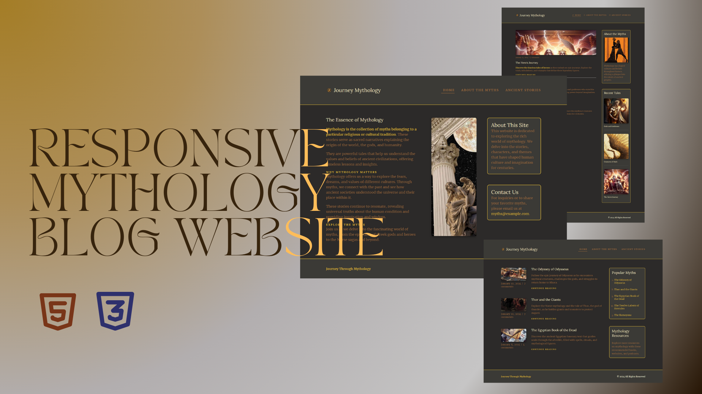

# Mythology Blog

## Description

**Mythology Blog** is a responsive test site designed to explore and showcase my responsive layout skills.

## Demo 

-[Mythology blog Demo](https://himihiba.github.io/mythology-blog/)

### Learning Highlights

- Implemented CSS-only mobile navigation, gaining comfort with properties like `order` and understanding the value of well-organized CSS classes.
- Utilized `em` units for padding and margins, and `rem` units for font sizes to ensure scalability and responsiveness.
- Employed CSS Grid and Flexbox to organize the layout and maintain responsiveness across different screen sizes.

## future plans

i plan to use this frontend site to search and learn about api's and local storage by making real blog and dynamique articals.

## Credits

This project was inspired by the teachings of Kevin Powell on his Scrimba channel. Special thanks to his free course, which has been instrumental in developing my responsive design skills.
-[Kevin Powell's Scrimba Course](https://youtube.com/playlist?list=PLqYFXd9GTRVWU_DqZo4D1r59ng46WdvL4&si=kU5Dt4QEGSYuh_xD)

### Screenshot

